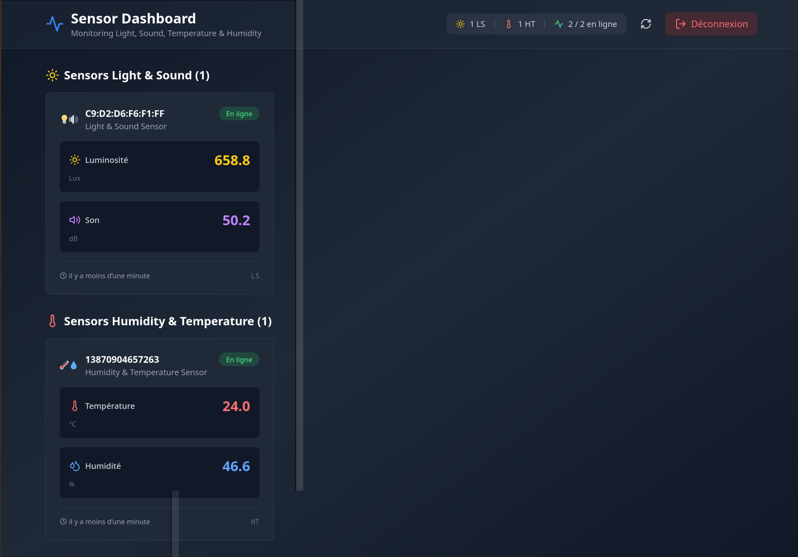
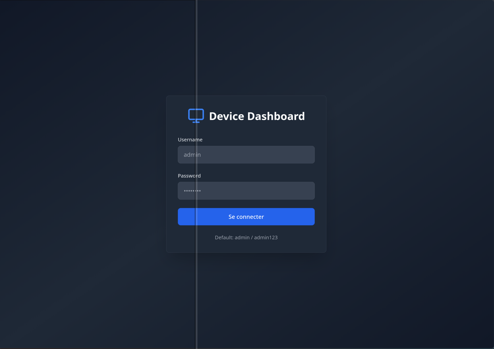
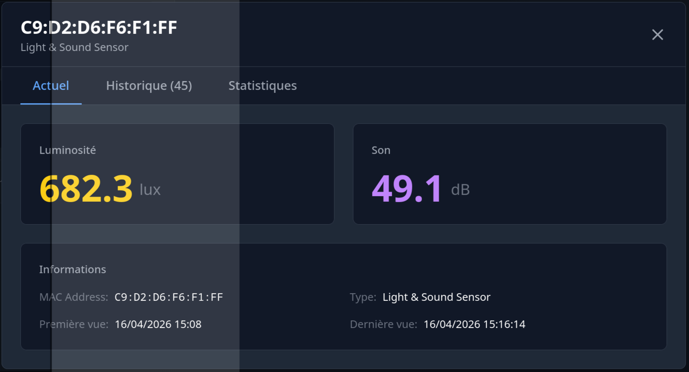
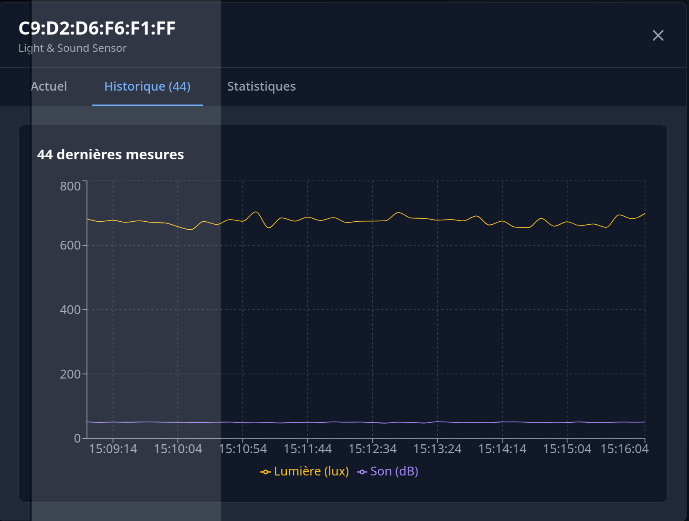
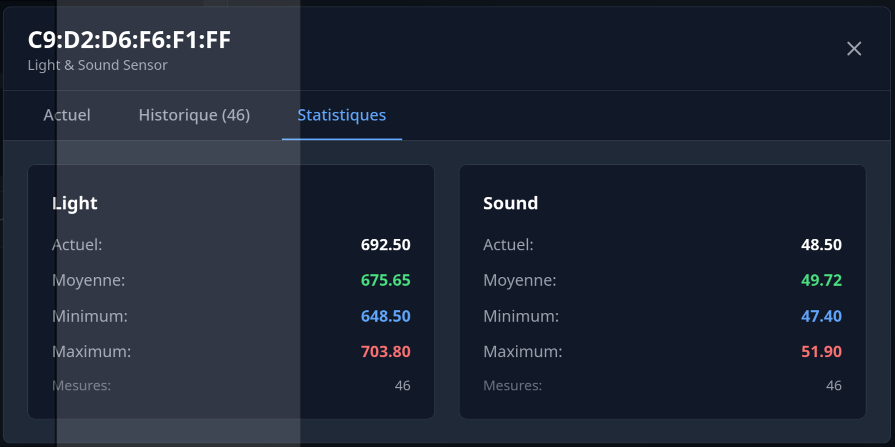

# 🖥️ Device Dashboard

Dashboard web pour monitorer et contrôler à distance tous tes devices (PCs Linux, Windows, smartphone, imprimante 3D).



## ✨ Fonctionnalités

### 📊 Monitoring temps réel des sensors
- Humidité, Température, Son, Lumière
- Moyenne
- Graphes en temps réel

### 🔄 Temps réel
- WebSocket pour updates instantanées
- MQTT pour communication bidirectionnelle

### 🔒 Sécurité
- Authentification JWT

## 🏗️ Architecture

```
┌─────────────────────────────────────┐
│            VPS/Server               │
│                                     │
│  ┌──────────┐  ┌────────────────┐  │
│  │Mosquitto │  │  Node.js API   │  │
│  │  MQTT    │←→│  + Socket.io   │  │
│  └──────────┘  └────────┬───────┘  │
│                         │           │
│                ┌────────▼────────┐  │
│                │  React Dashboard│  │
│                └─────────────────┘  │
└─────────────────────────────────────┘
           ↕ MQTT (port 1883)
┌─────────────────────────────────────┐
│                                     │
│                                     │
│  ┌────────┐           ┌─────────┐   │
│  │ Sensor │           │ Sensor  │   │
│  │   HT   │           │   LS    │   │
│  └───┬────┘           └────┬────┘   │
│      │                     │        │
│  ┌───▼─────────────────────▼─────┐  │
│  │      Python Agent             │  │
│  └───────────────────────────────┘  │
└─────────────────────────────────────┘
```

## 🚀 Quick Start

### 1. Installation VPS

```bash
# Clone le repo
git clone <repo>
cd MQTT-Dashboard

# Installer Mosquitto
sh setup_server.sh

# Installer le backend
cd backend
npm install
npm run dev

# Installer le frontend
cd ../frontend
npm install
npm run dev
```

### 3. Accès Dashboard

Ouvre `http://localhost:3001` dans ton navigateur.

Login par défaut: `admin` / `admin123` (mot de passe à definir avec le script `setup_server.sh`)

## 📁 Structure du Projet

```
device-dashboard/
│
├── backend/               # Backend Node.js
│   ├── server.js         # Serveur Express + Socket.io + MQTT
│   ├── package.json
│   └── .env
│
├── frontend/             # Frontend React
│   ├── src/
│   │   ├── components/  # Composants React
│   │   ├── pages/       # Pages (Login, Dashboard)
│   │   ├── services/    # API & Socket.io
│   │   ├── context/     # Auth context
│   │   └── hooks/       # Custom hooks
│   ├── package.json
│   └── vite.config.js
│
├── exemple_ht.py       # Script imittant un sensors HT (Humidité / Température)
├── exemple_ls.py       # Script imittant un sensors LS (Lumière / Son)
├── setup_server.sh     # Génération des configs backend et installation de mqtt sur le pc (Attention pour linux avec 'apt')
└── README.md
```

## 🛠️ Technologies

### Backend
- **Node.js** + Express
- **Socket.io** - WebSocket temps réel
- **MQTT.js** - Client MQTT
- **JWT** - Authentification

### Frontend
- **React** + Vite
- **TailwindCSS** - Styling
- **Recharts** - Graphiques
- **Socket.io-client** - WebSocket
- **Axios** - HTTP client
- **Lucide React** - Icônes


## 📊 API Endpoints

### Auth
- `POST /api/auth/login` - Authentification

### Devices
- `GET /api/devices` - Liste tous les devices
- `GET /api/devices/:deviceId` - Détails d'un device
- `POST /api/devices/:deviceId/history` - Historique d'un device
- `POST /api/devices/:deviceId/aggregate` - Moyennes d'un device

### Stats
- `GET /api/stats` - Statistiques globales

## 🎯 Topics MQTT
- `device/LS`
- `device/HT`


## 🎨 Screenshots

### Connection Page


### Dashboard


### Device Details


### Device Graph


### Device Aggregate

